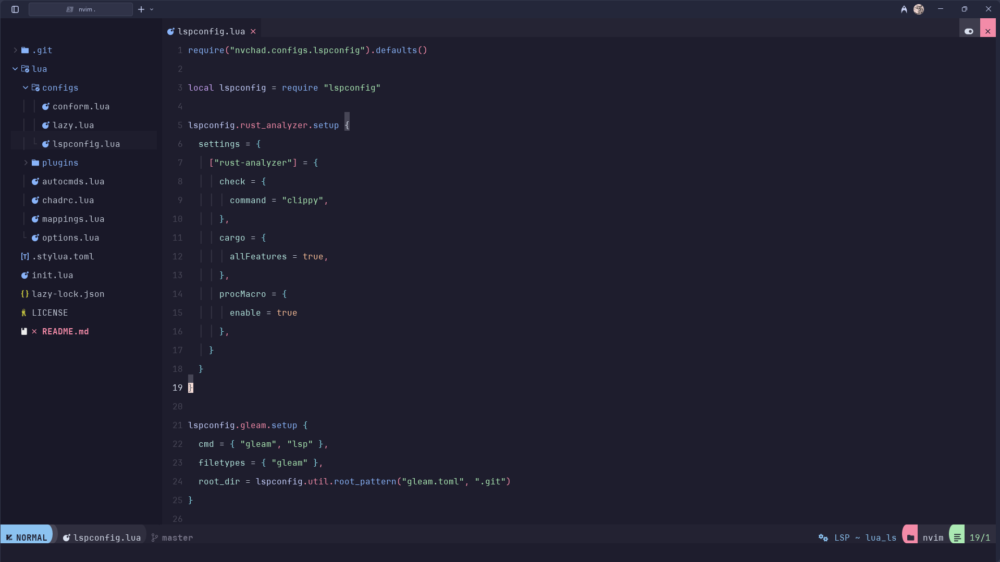

# My Neovim Configuration

A modern, efficient Neovim configuration built on top of [NvChad](https://nvchad.com/), optimized for Rust, Gleam, TypeScript/JavaScript, and general development work.

## ✨ Features

- **Modern UI**: Based on NvChad v2.5 with Catppuccin theme
- **Language Support**: Comprehensive LSP configuration for multiple languages
- **Code Formatting**: Automatic formatting with Conform.nvim
- **Smart Completion**: Enhanced completion with Blink
- **Syntax Highlighting**: Advanced Treesitter configuration
- **Developer Tools**: Integrated debugging and linting

## 🎨 Theme & UI

- **Theme**: Catppuccin with custom highlights
- **Statusline**: Round separator style with default theme
- **Completion**: Flat dark style with icon support
- **Telescope**: Borderless style for clean aesthetics
- **Dashboard**: Loads on startup for quick navigation

## 🛠️ Language Support

### Rust
- **LSP**: rust-analyzer with enhanced settings
- **Linting**: Clippy integration
- **Formatting**: rustfmt
- **Debugging**: codelldb support
- **Features**: All Cargo features enabled, proc macros supported

### Gleam
- **LSP**: Native Gleam language server
- **Project Detection**: Automatic detection via `gleam.toml`

### TypeScript/JavaScript
- **LSP**: Deno language server
- **Project Detection**: Supports `deno.json`, `deno.jsonc`, `deno.lock`
- **Linting**: Built-in Deno linting

### Additional Languages
- Lua, Vim, JSON with full syntax highlighting and LSP support

## ⚙️ Installation

### Prerequisites
- Neovim >= 0.9.0
- Git
- A [Nerd Font](https://www.nerdfonts.com/) for icons
- Bash (configured for Git Bash on Windows)

### Setup

1. **Backup existing configuration** (if any):
   ```bash
   mv ~/.config/nvim ~/.config/nvim.backup
   ```

2. **Clone this configuration**:
   ```bash
   git clone https://github.com/MandoPurba/my-neovim.git ~/.config/nvim
   ```

3. **Start Neovim**:
   ```bash
   nvim
   ```

4. **Install plugins** (automatic on first launch):
   - Lazy.nvim will automatically install all plugins
   - Mason will install the configured LSP servers and tools

## 🔧 Configuration Structure

```
├── init.lua                    # Entry point
├── lua/
│   ├── chadrc.lua             # NvChad configuration
│   ├── options.lua            # Neovim options
│   ├── mappings.lua           # Key mappings
│   ├── autocmds.lua           # Auto commands
│   ├── configs/
│   │   ├── conform.lua        # Formatter configuration
│   │   ├── lazy.lua           # Plugin manager settings
│   │   └── lspconfig.lua      # LSP server configurations
│   └── plugins/
│       └── init.lua           # Plugin specifications
```

## ⌨️ Key Mappings

### Custom Mappings
- `Space` - Leader key
- `;` - Enter command mode (normal mode)
- `jk` - Exit insert mode
- `Ctrl+s` - Save file (commented out, uncomment if needed)

### NvChad Default Mappings
This configuration inherits all default NvChad mappings. Key highlights:
- `Space + e` - Toggle file explorer
- `Space + ff` - Find files
- `Space + fg` - Live grep
- `Space + fb` - Find buffers
- `Space + th` - Change themes

## 📦 Installed Tools

### Mason-managed Tools
- **rust-analyzer** - Rust language server
- **codelldb** - Debugger for Rust and C++
- **rustfmt** - Rust formatter
- **clippy** - Rust linter
- **deno** - TypeScript/JavaScript runtime and LSP

### Treesitter Parsers
- vim, lua, vimdoc
- gleam, rust
- typescript, javascript, json

## 🎯 Customization

### Adding New Languages
1. Add Treesitter parser in `lua/plugins/init.lua`:
   ```lua
   ensure_installed = {
     -- existing parsers
     "your-language",
   }
   ```

2. Configure LSP in `lua/configs/lspconfig.lua`:
   ```lua
   lspconfig.your_lsp.setup {
     -- your configuration
   }
   ```

3. Add Mason tool in `lua/plugins/init.lua`:
   ```lua
   ensure_installed = {
     -- existing tools
     "your-lsp-server",
   }
   ```

### Changing Theme
Edit `lua/chadrc.lua`:
```lua
M.base46 = {
  theme = "your-preferred-theme",
}
```

Available themes: `onedark`, `gruvbox`, `nord`, `tokyonight`, `catppuccin`, and many more.

## 🔍 Troubleshooting

### Common Issues

1. **Plugins not loading**: Run `:Lazy sync` to update plugins
2. **LSP not working**: Check `:LspInfo` and ensure servers are installed via `:Mason`
3. **Shell issues on Windows**: Configuration includes Git Bash setup
4. **Font icons missing**: Install a Nerd Font and configure your terminal

### Health Check
Run `:checkhealth` to diagnose configuration issues.

## 📸 Screenshots

**

## 🤝 Contributing

Feel free to fork this configuration and make it your own! If you have improvements or fixes, pull requests are welcome.

## 🙏 Acknowledgments

- [NvChad](https://nvchad.com/) - For the amazing base configuration
- [Neovim](https://neovim.io/) - For the best text editor
- All plugin authors and maintainers

---

**Happy coding! 🚀**